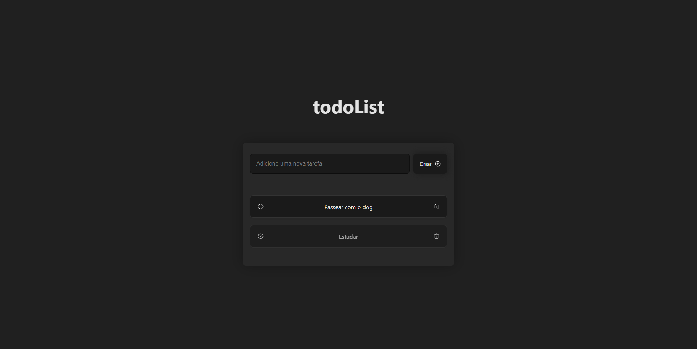

<h1 align="center">todoList</h1>

<div align="center">
  Um aplicativo para gerenciar suas tarefas e aumentar sua produtividade.
</div>

<p align="center">
  <a href="https://todolistsamuell.vercel.app/">🔗 Visite o projeto</a>
</p>

<!-- Conteudo -->

## Conteudo

- [Pré-visualização](#visualização)
- [Tecnologias](#tecnologias)
- [Características](#características)
- [Como usar](#como-usar)

<!-- Pré-visualizacão -->

## Visualização



<!-- Feito com -->

## Tecnologias

- [React](https://reactjs.org/)
- [Vite](https://vitejs.dev/)
- [React Icons](https://react-icons.github.io/react-icons)
- [UUID](https://www.uuidgenerator.net/)

<!-- CARACTERÍSTICAS -->

## Características

- Adicionar tarefas
- Concluir tarefas
- Deletar tarefas

<!-- COMO USAR -->

## Como usar

Para clonar e executar este aplicativo, você precisará do [Git](https://git-scm.com) e do [Node.js](https://nodejs.org/en/download/) (que vem com o [npm](http://npmjs.com)) instalados em seu computador.

```bash
# Clone o repositório
$ git clone https://github.com/joaoliveirapb/todo.git

# Instale as dependencias
$ npm install

# Inicie o projeto
$ npm run dev
```
<br>
<br>
<!-- CONTACT -->

Feito com ♥ por Samuell Torres :wave:   [Entre em contato!](https://www.linkedin.com/in/samuelltorres/)
